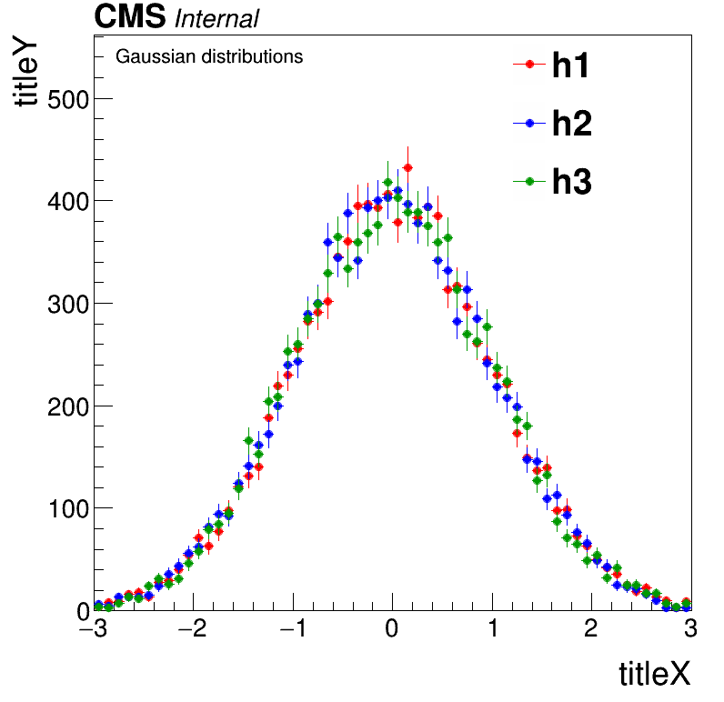

# Example codes for HistCanvas & GraphCanvas
## Step1: make input root file
```
cd Input
root -l -b -q InputGenerator.cxx
cd ..
```
It will generate `ROOTFile_Input.root`, which will be used for the example plotting code.

## Step2: run the example code
```
root -l -b -q Example_HistCanvas.cxx
root -l -b -q Example_GraphCanvas.cxx
```


## Example results


